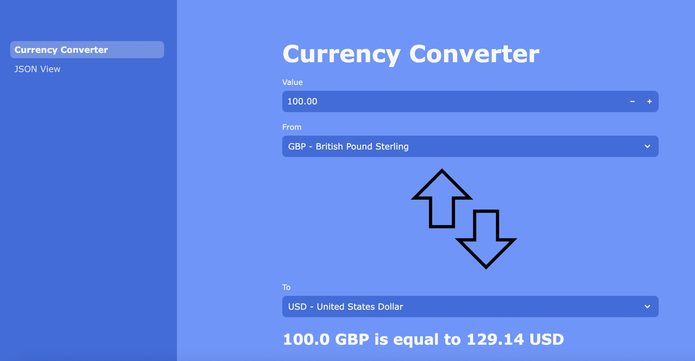

  

# Currency Converter

The Currency Converter is a web application that allows users to convert between different currencies using real-time exchange rate data. The application is built with Python and Streamlit, and it fetches exchange rate information from a reliable API.

## Features

- Real-time exchange rate data
- Supports a wide range of currencies
- Easy-to-use Streamlit UI

## Deployment
The app is currently deployed locally but in the future will be hosted on an Ubuntu server instance on my Raspberry Pi 5.

## Example

